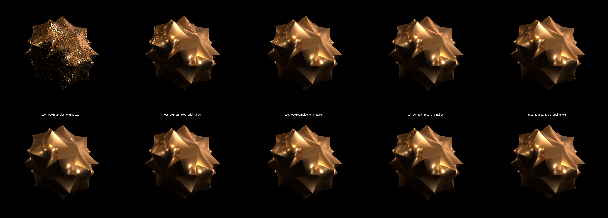

# r-display

[NSI](https://nsi.readthedocs.io/)/[RenderMan®](https://renderman.pixar.com/)
[OpenEXR](http://www.openexr.com/) display driver with Open Image Denoise support written in Rust.

Build instructions should work for **Linux** and **macOS**. On **Windows** your
mileage my vary.

## Building

The [`ndspy-sys`](https://github.com/virtualritz/r-display/blob/master/ndspy-sys/)
crate which is part of this project uses the `DELIGHT` environment variable
to find the needed display driver API headers. If you have 3Delight installed
this will *just* work.

You need a copy of Intel® Open Image Denoise (IOID). Grab a package from
their [download section](https://www.openimagedenoise.org/downloads.html).
Unpack this somewhere.

### Linux

Export the OIDN location for the build to find the headers & libraries. For
example:
```
export OIDN_DIR=$HOME/Downloads/oidn-1.2.1.x86_64.macos/
```

Build the display driver:
```shell
./build-linux.sh
```

### macOS

Export the OIDN location for the build to find the headers & libraries. For
example:
```
export OIDN_DIR=$HOME/Downloads/oidn-1.2.1.x86_64.macos/
```

Build the display driver:
```shell
./build-macos.sh
```

## How To

There is an example app in `examples/denoise.rs`. This shows how to add the two
optional auxiliary AOVs for albedo & normal when instancing the display driver
through the [NSI crate](https://crates.io/crates/nsi).

```shell
cargo run --example denoise
```

This will launch the render an dump the raw data of a render with *one* sample
per pixel to 3Delight Display. It will save a denoised version to
`test_0001samples.exr`.

## Parameters

### Denoising



The display driver uses [Intel® Open Image Denoise](https://www.openimagedenoise.org/)
to denoise the 1st set of RGB channels. This is **switched on by default**.

Use the`denoise` (`float`) parameter to control this.

Setting this to **zero** switches denoising *off*.

Setting this to a value above *0* and below *1* linearly blends then denoised
image with the original.

Setting it to **one** (or above) switches denosing on. This means the original
pixels will be discarded and replaced with denoised ones.

If you want support for keeping the original image in a separate layer of the
EXR open an issue and I see what can be done.

If you want to use **albedo** and **normal** (requires the former) layers to
improve the denoising you need to add support for outputting `albedo` from your
OSL shaders.

For example if `albedo` contains the albedo add sth. like this to your OSL
shader:
```glsl
if( raytype("camera") )	{
    outColor += debug("albedo") * albedo;
}
```

### Compression

This display driver supports the following OpenEXR compression methods which
are set by the `compression` (`string`) parameter:

-   [x] `none` uncompressed
-   [x] `zip` (lossless)
-   [x] `rle` (lossless)
-   [x] `piz` (lossless)
-   [x] `pxr24` (lossy)
-   [ ] `b44`, `b44a` not yet supported
-   [ ] `dwaa`, `dwab` not yet supported

### Other

When `premultiply` (`integer`) is set to **zero** the image will be written out
*unpremultiplied*.

A `line_order` parameter can be used to set this explicitly to e.g. store the
image bottom-top. Accepted values are `increasing` and `decreasing`.
If unspecified the driver will choose a line order matching the compression.

A `tile_size` (`integer[2]`) parameter can be specified to set the width and
height of the tiles the image is stored in.
If unspecified the driver will choose a tile size matching the compression.

## Caveats

The display driver needs work if one wanted to use it for multi-layer EXRs
(e.g. writing a single EXR that contains a bunch of AOVs as layers).

What would be needed was a way to designate which input layers should be
denoised and maybe also a way to filter out utility passes only added
for the denoiser so they don’t take up disk space.

If you want to use this in production and need those features ping me.

### Metadata

The display driver exports some metadata that is common to EXR files:

-   [x] `pixel aspect`
-   [x] `world to camera`
-   [x] `world to normalized device`
-   [x] `near clip plane`
-   [x] `far clip plane`
-   [x] `software name`
